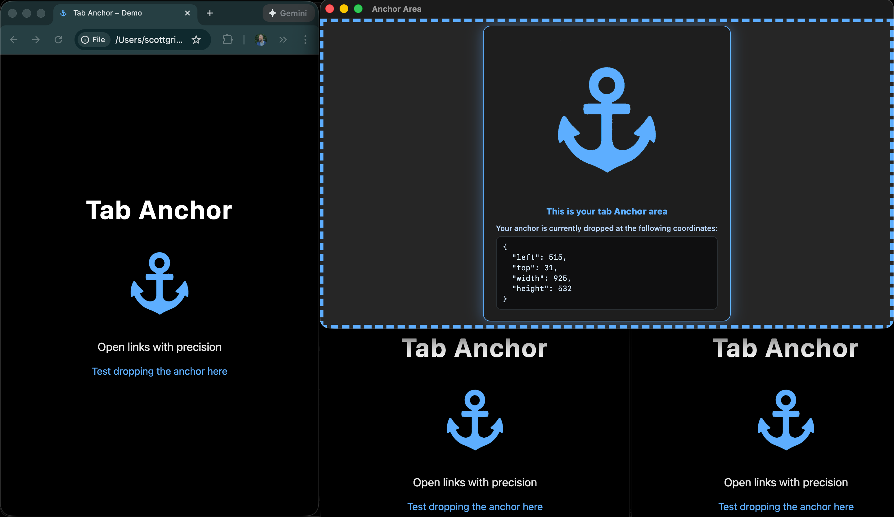
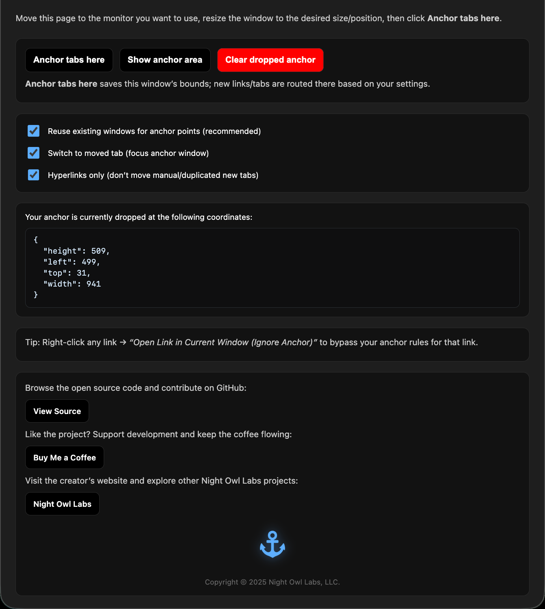

    

 

    
    
     
    
    
    
     
    
    
    
     
    

---------------

<h1 align="center">Tab Anchor</h1>

**Tab Anchor** is a [Google Chrome Extension](https://developer.chrome.com/docs/extensions) that lets you _anchor_ a specific monitor and window region so that **all new tabs and pop-ups automatically open there**.  
Whether you work across multiple monitors or keep certain tabs in a fixed workspace, Tab Anchor makes tab organization effortless.

Download it today from the [Chrome Web Store](https://chrome.google.com/webstore/detail/tab-anchor/heandnaaoakojdkoomhklpcmikikbbej)!

_It’s perfect for developers, multitaskers, traders, and anyone who wants consistent tab placement across multiple screens._

    
     
    <i>Always open tabs in the menu and monitor you want</i>

 

    
     
    <i>Set options to fit your workflow</i>

---

## Table of Contents

- [Features](#features)
- [How It Works](#how-it-works)
- [Installation](#installation)
- [Usage](#usage)
- [Settings](#settings)
- [Context Menu](#context-menu)
- [Overlay Preview](#overlay-preview)
- [Changelog](#changelog)
- [Resources](#resources)
- [License](#license)
- [Credits](#credits)

## Features

- 🎯 **Anchor a monitor** so all new tabs and pop-ups open in that specific region.
- 🔄 **Reuse existing windows** (recommended) or always create new ones.
- 🔗 **Hyperlinks-only mode**—only anchor `target="_blank"` links and pop-ups.
- ➕ **Moves duplicate / manual new tabs** (optional, configurable).
- ✨ **Show anchor preview overlay** to visually confirm placement.
- 🔍 **Bypass anchor** via right-click context menu.
- 🖥️ **Optimized for multi-monitor workflows**.
- 🔐 **No data collection**—everything is stored locally in Chrome.

## How It Works

Tab Anchor uses Chrome’s window APIs to:

1. Capture the bounds of your current window when you select **Anchor tabs here**.
2. Save these coordinates (`left`, `top`, `width`, `height`) as the anchor target.
3. Route pop-ups and hyperlink tabs (`window.open`, `target=_blank`) to that anchored region.
4. Optionally move _all_ new tabs (manual or duplicated).
5. Display a visual overlay so you always know where your anchor is.

## Installation

### From the Chrome Web Store

1. Visit the [Chrome Web Store listing for Tab Anchor](https://chrome.google.com/webstore/detail/tab-anchor/).
2. Click **Add to Chrome**.
3. Confirm by clicking **Add Extension**.
4. The extension icon will appear in your toolbar.

### Developer Installation (Local)

1. Clone or download this repository.
2. Open `chrome://extensions`.
3. Enable **Developer Mode**.
4. Click **Load Unpacked**.
5. Select the project folder.

That’s it. You’re ready to go 🚀

## Usage

### 📌 Drop an Anchor

Move and size the window you want to anchor.  
Then open the extension popup → click:

**Anchor tabs here**

All new pop-ups and hyperlink tabs will now open there.

### 🔍 Show the Anchor Overlay

Click **Show anchor area** to display a temporary preview overlay showing:

- The anchor region
- Coordinates
- Tab Anchor logo
- A dashed border around the active anchor zone

### 🧹 Clear an Anchor

Open the Options page → click:

**Clear dropped anchor**

## Settings

All settings are found in `Options`:

### ✔ Reuse Existing Windows (Recommended)

Reuse a window already on the anchor monitor instead of creating new ones.

### ✔ Switch to Moved Tab

Automatically focuses the anchor window + tab when moved or created.

### ✔ Hyperlinks Only

If ON:

- Only hyperlink-based tabs are anchored.

If OFF:

- **All** new tabs—including duplicates—are anchored.

## Context Menu

Right-click any link →  
**“Open Link in Current Window (Ignore Anchor)”**

This lets you bypass the anchor for specific actions.

## Overlay Preview

The anchor overlay includes:

- A darkened screen
- Blue dashed border (`#5daeff`)
- Anchor logo
- Coordinate info box
- Auto-close when window is dismissed

Useful for verifying your anchor placement.

## Changelog

See the full changelog:  
📄 **[CHANGELOG](.github/CHANGELOG.md)**

## Resources

- [Google Chrome](https://www.google.com/chrome/)
- [Chrome Extensions Documentation](https://developer.chrome.com/docs/extensions/)
- [Chrome Web Store](https://chrome.google.com/webstore/category/extensions)

## License

This project is released under the terms of the **MIT License**, which permits use, modification, and distribution of the code, subject to the conditions outlined in the license.
- The [MIT License](https://choosealicense.com/licenses/mit/) provides certain freedoms while preserving rights of attribution to the original creators.
- For more details, see the [LICENSE](LICENSE) file in this repository. in this repository.

## Credits

**Author:** [Night Owl Labs, LLC.](https://github.com/Night-Owl-Labs)  
**Email:** [support@nightowllabs.io](mailto:support@nightowllabs.io)  
**Website:** [nightowllabs.io](https://www.nightowllabs.io)  
**Reference:** [Main Branch](https://github.com/Night-Owl-Labs/Software-ilities)  

---------------

    

<!-- End README -->